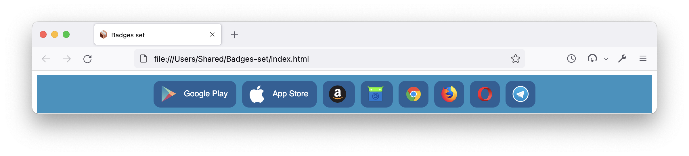
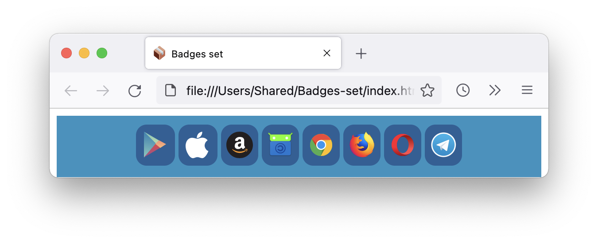

# Badges set

#OpenSource #Badges #Set

[Badges set](https://github.com/Smied-net/Badges-set) - is an open source project.

**Smied.net links:**

[Website](https://Smied.net/) | [Documentation]() | [Feedback](https://Feedback.Smied.net/)

[Support](https://Help.Smied.net/) | [Community Support]()

# Screenshots

|  |  |
|:---------:| :---------:|
| Desktop Page | Mobile Page |

# Demo

[Demo](https://smied-net.github.io/Badges-set/Badges.html)

# Customization

## Icons

[Simple-icons](https://github.com/simple-icons/simple-icons/)

[Vectorlogozone](https://github.com/VectorLogoZone/vectorlogozone/)

## Badges

Apps stores:

Google - https://play.google.com/intl/en_us/badges/

Apple - https://developer.apple.com/app-store/marketing/guidelines/#section-badges

F-Droid - https://gitlab.com/fdroid/artwork/tree/master/badge

Aptoide - https://dev.aptoide.com/page/badge

App gallery - https://developer.huawei.com/consumer/en/doc/development/AppGallery-connect-Guides/appgallery-agd-create-stamped

Galaxy store - https://developer.samsung.com/galaxy-store/gsb-promotion.html

Amazon Store - https://developer.amazon.com/support/legal/tuabg

Direct download -

Browser extension stores:

Chrome Web Store - https://developer.chrome.com/docs/webstore/branding/

Firefox - https://blog.mozilla.org/addons/2015/11/10/promote-your-add-ons-with-the-get-the-add-on-button/

Opera - https://dev.opera.com/extensions/branding-guidelines/

Edge - https://developer.microsoft.com/en-US/store/badges/

Safari - https://developer.apple.com/app-store/marketing/guidelines/#section-badges

Direct download -

# Donate

# Main

## VPS

